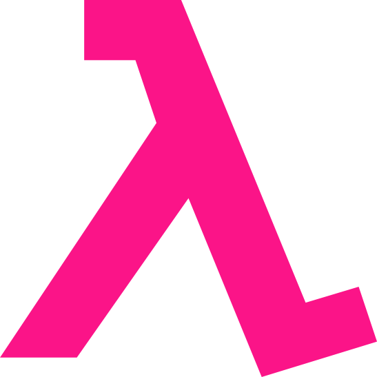
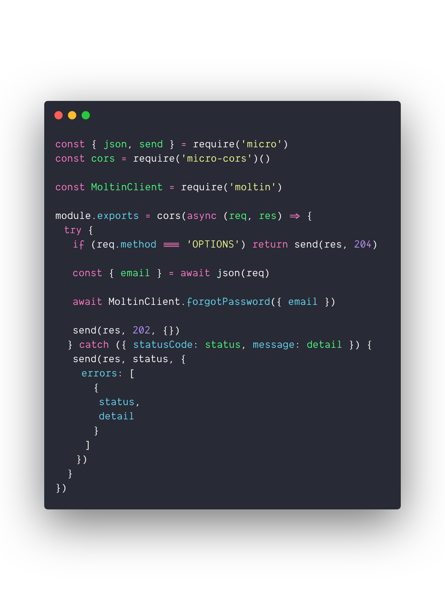
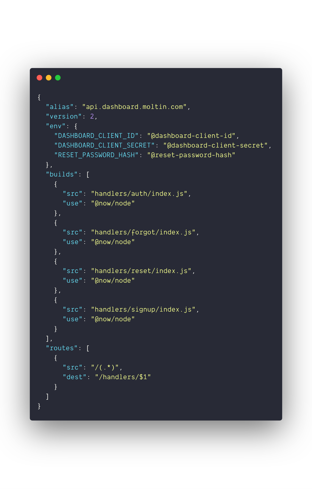

import layout from './layout'

import { Image, Notes } from '@mdx-deck/components'

export { default as theme } from './theme'

---

<Image src="images/moltin.png" />

<Notes>
  I'm Jonathan, a developer working at Moltin. Moltin is a headless commerce
  platform based in Boston and Newcastle. I lead the dashboard team as well as
  contribute to API tooling and open source, such as our SDKs.
</Notes>

---

<Image src="images/fme.png" />

<Notes>
  I also co-own First Means Everything, a company that runs functional fitness
  events. I built an open-source GraphQL API to handle athlete payments,
  registration, workout scores and competition leaderboards.
</Notes>

---

export default layout

# WTF is _serverless_ anyway

<Notes>
  Serverless architecture (also known as serverless computing or function as a
  service, FaaS) is a software design pattern where applications are hosted by a
  third-party service, eliminating the need for server software and hardware
  management by the developer. Applications are broken up into individual
  functions that can be invoked and scaled individually.
</Notes>

---

export default layout

# Why serverless?

<Notes>
  Why serverless? What are some of the advantages a serverless architecture
  could bring to your stack?
</Notes>

---

export default layout

# 1. No servers

Well, _kind of_

<Notes>
  The term serverless is somewhat of a misnomer. There are still servers
  computing your code. The benefit is that the configuration and maintenance of
  these servers is abstracted away to providers such as AWS and Google. Meaning
  you only need to care about the performance and execution of your code.
</Notes>

---

<Image src="images/chan.jpg" />

---

export default layout

# 2. Cost reductions

Only pay for resources you're utilising

<Notes>
  The premise of serverless is based entirely around execution of code. You're
  only actually billed for the resources used during execution of your code,
  rather than for the entirety of uptime for a given period of time.
</Notes>

---

export default layout

# 3. Scaling

Let your infrastructure scale infinitely with your application

<Notes>
  Since serverless functions are stateless and invoked by an event such as a
  HTTP request, you can run as many (or as few) as you need. Application gone
  viral? Not a problem. Leave the hardware concerns to the provider.
</Notes>

---

export default layout

# 4. Focus on code

Defer to the experts and focus on writing your code

<Notes>
  Who really wants to configure and maintain backend architecture? Leave this to
  the experts and focus on building your application to be as performant as
  possible.
</Notes>

---

export default layout

# Serverless computing already _surrounds_ us

IoT, service integrations and more

<Notes>
  Serverless computing has a long history, and has become an increasing popular
  framework within the past 3-4 years. IoT devices, 3rd party integrations are
  just a couple examples of how serverless architecture is utilised by
  developers across the web. At Moltin, our billing and caching services are
  backed by serverless technologies. Customers utilise our events API to power
  serverless integrations with 3rd party services such as Postmark and Twilio.
</Notes>

---

export default layout

# Breaking down the monolith

Applying the serverless model to an API

<Notes>
  In the world of Node, Express, Hapi, Koa and similar frameworks rule the
  roost. Their built-in tools for routing and middleware make them a popular
  choice when starting a new project. However these frameworks often add bloat
  and complexity when often it is needed. More cases than not, the same
  functionality can be achieved utilising a serverless approach.
</Notes>

---

<Image src="images/kondo.jpg" />

<Notes>
  If there's anything Marie Kondo taught us it's that simplicity and
  decluttering are vital to any home. I believe the same principles can be
  applied to web applications.
</Notes>

---

export default layout

# 1. Separation of concerns

Clearly defined responsibilities, modules and logic

<Notes>
  Since each function is isolated, it handles its own responsibilities. We may
  have one route that includes a Node dependency, whilst the other routes do
  not. This separation allows each function to require its own modules and
  logic, which in turn, reduces error surface and helps when debugging issues.
</Notes>

---

export default layout

# 2. Stability

Distributed points of failure

<Notes>
  In monolithic Node applications, there is a single point of failure for the
  entire system. In a serverless architecture, we have distributed points of
  failure. Each function is self-contained. Because of this, if one function is
  failing, the other function can continue serving users. This is a significant
  benefit of serverless architectures.
</Notes>

---

export default layout

# 3. Shared resources

Define common middleware or libraries to be shared across functions

<Notes>
  Abstract any shared logic into libraries that can be passed around your
  functions. This is applicable for things such as database connections,
  middleware or connecting to external services.
</Notes>

---

export default layout

# 4. Language agnostic

Use the best language for the job

<Notes>
  There is no preconceived language in a serverless application, allowing you to
  use the best tools for the job at hand.
</Notes>

---

export default layout

<Notes>
  One company at the forefront of the serverless computing movement is Zeit.
  Founded in 2015, Zeit are famed for the creation of Next.js (a SSR React
  framework), micro (their asynchronous Node framework) and of course their
  cloud platform Now.
</Notes>

---

export default layout

> Our mission is to make cloud computing accessible to everyone.

<Notes>
  In November of 2018, Zeit introduced an ambitious version 2 of their cloud
  platform Now. Behind the scenes changes essentially made Now a compiler,
  capable transforming your sources in various languages to static files or
  lambdas. Also included in this release was support for monorepos and
  concurrent builds. The combination of features in this release made the
  possibility of truly serverless APIs a reality.
</Notes>

---

export default layout

# Superior developer experience

Immutable deployments, auto aliasing, global CDN

<Notes>
  One of the areas that really sets Zeit apart from other cloud platforms is the
  amazing developer experience. Immutable deployments, auto aliasing and
  powerful configuration make getting started a breeze. These are all available
  as a standard feature of the platform.
</Notes>

---

export default layout

# Large selection of builders

Don't by limited by language

<Notes>
  The builders are at the core of Now. They take the source code of a single
  function and compile that into a compatible lambda. This allows for you to
  build a completely language agnostic, serverless application from a single
  monolithic repository. Zeit currently offer builders for Node.js, Go, PHP,
  Python, Rust and static assets.
</Notes>

---

export default layout

<Notes>
  This is an example of an asynchronous Node.js function. We're exposing this
  function via route which can be called externally. As you can see we're
  importing a local dependency (MoltinClient) which is defined and exported
  inside the repository. As each function has its own package file, this
  dependency can be required on a per function basis and therefore reducing
  bundle size of the compiled lambda.
</Notes>

---

export default layout

# Easily configurable

Define your builds, routing and more in `now.json`

<Notes>
  Your application is configured in a single JSON object which is read during
  deployment. Here we can specify environment variables, configure the builds
  for our sources and setup routing with HTTP methods and other options. This is
  the basis for composing the API from our various lambda sources.
</Notes>

---

export default layout

---

export default layout

# Deploy with `now`

Deploy direct from the CLI or automated via version control

<Notes>
  Once fully configured your project can be easily deploy via the Now CLI tool.
  Deployments can also be automated via version control, using the respected
  GitHub and GitLab applications. This will trigger immutable deployments on
  each commit, and auto alias any deployment from your master branch. This
  continuous deployment
</Notes>

---

# 😄

Thanks for listening
